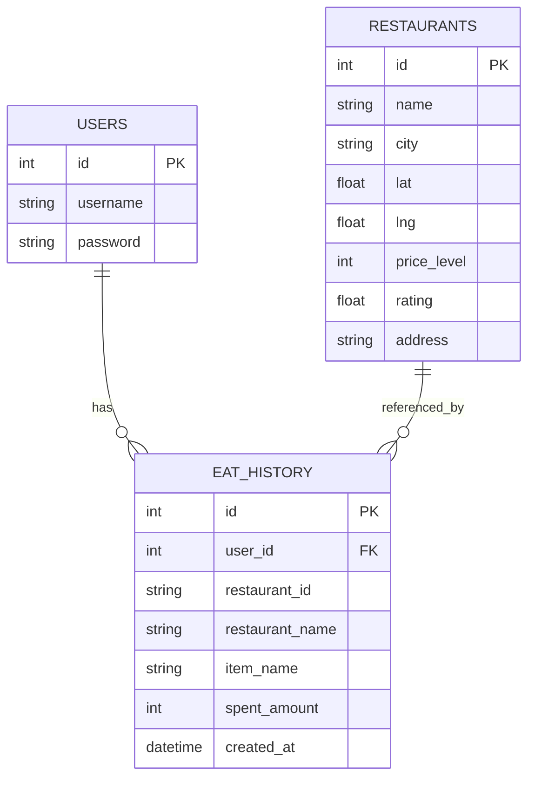

# 🗄️ 資料模型設計 (MODELS) - Food Decider (v4)

## 1. 實體關聯圖 (ERD)

## 2. 資料表詳細設計

### 2.1 表名：`restaurants` (擴充版)
- **用途**：自建的餐廳口袋名單。
- `id` (INTEGER, PK, AutoIncrement)
- `name` (TEXT, Not Null)：餐廳名稱
- `city` (TEXT)：**[新增]** 所屬縣市（例如：台北市、台中市），方便列表過濾。
- `lat` (REAL, Not Null)：緯度
- `lng` (REAL, Not Null)：經度
- `price_level` (INTEGER, Not Null)：價格等級 (1~4)
- `rating` (REAL)：評價 (0.0~5.0)
- `address` (TEXT)：地址字串（作為顯示用途）
